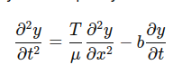
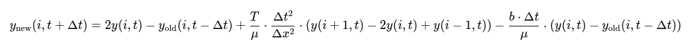

# Opis projektu 
Projekt symuluje wizualnie oraz dźwiekowo falę poprzeczną na strunie wraz z wytracaniem enregii. W tym celu zostala zrealizowana prosta aplikacja w której uzytkowni może modyfikować napięcie struny oraz współczynnik wytracania energii.  

# Model matematyczny 
1. Równanie falowe

  
​
gdzie:  
y(x,t) to przemieszczenie struny,  
T to napięcie struny,  
μ to gęstość liniowa struny,  
b to współczynnik tłumienia.

# Dyskretyzacja



# Uruchomienie
1. ```sh
    git clone https://github.com/Matthev00/FO
    ```
2. 
    ```sh
    python3 -m venv .venv
    ```
3. 
    ``` sh
    source .venv/bin/activate
    ```
3. 
    ``` sh
    pip install -r requirements.txt
    ```
4. 
    ```sh 
    streamlit run main.py
    ```

# Użyte zostały dwa modele generatywne GPT 4o i Copilot