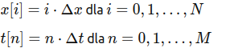

# Model matematyczny 
1. Równanie falowe


  
​
gdzie:  
y(x,t) to przemieszczenie struny,  
T to napięcie struny,  
μ to gęstość liniowa struny,  
b to współczynnik tłumienia.

# Dyskretyzacja



# Uruchomienie
1. ```sh
    git clone
    ```
2. 
    ```sh
    python3 -m venv .venv
    ```
3. 
    ``` sh
    pip install -r requirements.txt
    ```
4. 
    ```sh 
    streamlit run main.py
    ```
